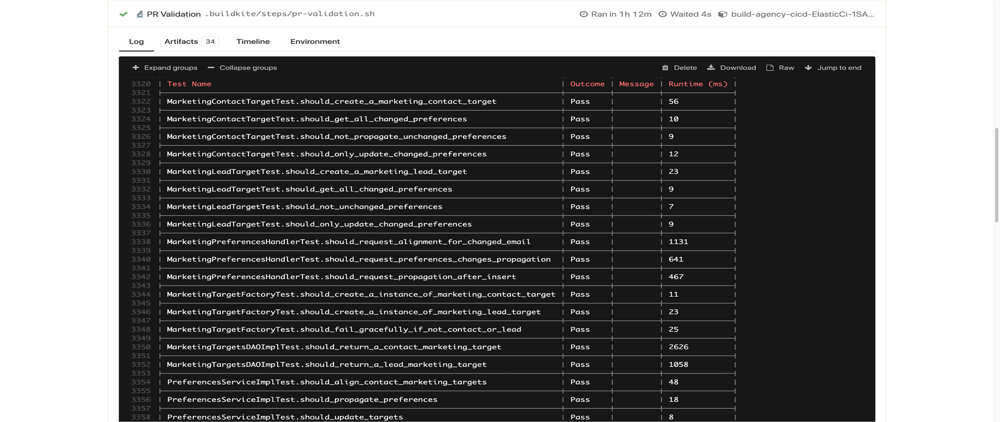

# Validation in Continuous Integration

Validation of code and configuration is a must do in all development, Salesforce itself has ways of stopping deployments into production environments with improper testing and config. Such as not being able to deploy with less than 75% test coverage, making sure 100% of tests pass and blockers on deploying incorrect dependencies.

**This is a good thing!** No one, specifically not your project manager or client leads, wants untested or failing code/configuration being deployed to production environments.

We understand though that, albeit a necessary activity, validation of code and configuration can be time-consuming. The time to spin up orgs, install dependencies, install packages and then test the code can take up a whole day. Add on the effort of writing scripts in a Continuous Integration pipeline and it becomes an over-whelming task which everyone is hoping they can palm off to a junior dev.

Using open-source tooling, sfdx and scratch orgs, you can include your testing processes as part of pull requests using **any** Continuous Integration tool before the code is merged into your main branch. Align this validation with scratch org pooling using the ‘prepare’ command as discussed [here](https://www.linkedin.com/pulse/scratch-orgs-scale-part-2-caitlyn-mills/), and your validation can be quick and simple.

The command to use, is deceptive, it looks too simple. Underneath the hood though, there is a lot of work happening which you as a developer would have to execute in separate tasks through your CI pipeline, or worse execute manually. Let’s have a look at the command:

```
sfp orchestrator:validate -f $(devhubKey.secureFilePath) -i $(DEVHUB_CLIENT_ID) -p CI2 -u $(DEVHUB_USERNAME) -x
```

**Let’s give you a quick run through of what this command is doing:**

1. Authenticates to the DevHub using the provided JWT Key / Client ID
2. Fetches a scratch org from the provided pools in a sequential manner
3. Authenticate to the Scratch org using the provided JWT Key / Client ID
4. Build packages that are changed by comparing the tags in your repo against the packages installed in scratch org

**Next for each of the packages**

1. Deploy changed packages to the scratch org
2. Trigger Apex Tests if there are any apex test in the package
3. Validate test coverage of the package depending on the type of the package (source packages: each class needs to have 75% or more, unlocked packages: packages as whole need to have 75% or more)

That last step (**number 3**) is a new one. We have utilized the open-source component [‘apex-parser’](https://github.com/nawforce/apex-parser) to implement a method which determines whether the package is an unlocked or source package and then bases the code coverage validation on which type of package it is.

All of this will run in your CI tool and give you a pass/fail result of the code about to be merged. This will save you time in your current validation practices, especially when combined with the ‘prepare’ orchestrator function offered by sfpowerscripts.



If for some reason you don’t want to use the orchestrators ‘prepare’ command or scratch org pooling, you can still use a scratch org or any other org. The variant of this is a command called called ‘**validateAgainstOrg’** where you can supply an org, such as a scratch org (not a part of a pool) or even a development org. **Note:** It is strongly recommended to use the prepare commands to build a scratch org pool for use in this validation, as it will be the most effective option in terms of accuracy.

Hold on a minute, why isn’t there a static code analysis in the validation? In terms of pipeline design, it was thought that a static code analysis is best to be run separately, as there will be times when you don’t want your PMD analysis to break your build, or you are working with code which has known static problems on the back-burner for fixing – this doesn’t mean you want your validation or deployment’s to be on hold. There are plans with the sfpowerscripts gurus to create a separate analysis command which will work in a similar way as this. A static code analysis result will not make your code undeployable in a production environment, but it is bad practice, and it is always recommended to use static code analysis in parallel with your Apex tests. Simply put, as the command names suggest, one is an analysis, and one is a validation.

Of course, we are not done with the validate command. Already in the works is an impact analysis, so you can visualize exactly how the changes you are introducing are going to affect your existing components.

Check out the [source code](https://github.com/Accenture/sfpowerscripts/tree/develop/packages/sfpowerscripts-cli/src/commands/sfpowerscripts/orchestrator) for more information on how the validate commands work, look at the [sample pipelines](https://github.com/dxatscale/easy-spaces-lwc/tree/develop/.github/workflows) to get started or get in touch with us on [Slack](http://dxatscale.slack.com).
